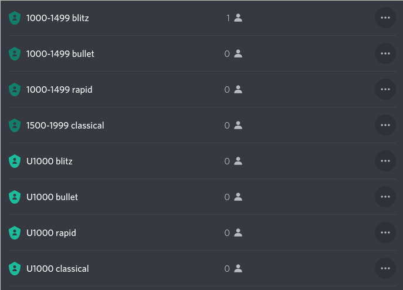

# liro

Liro is a Discord bot that follows in the footsteps of
[Lichess-discord-bot](https://github.com/tvdhout/Lichess-discord-bot/), without
necessarily aiming to replace it. The main pain point that this bot is trying
to solve is automating the role assignment for denizens of the IM Rosen Discord
server.

This project also aims to increase rating support to not only lichess accounts,
but also chesscom.

# Invite

***Please note***: Liro is still being developped heavily. We do not provide
uptime guarantees, and things related to role management might break in the
near future. In addition, you might have to re-invite the bot in the future to
add/remove permissions due to the changes that Discord is making to
permissions.

You can now invite Liro to [join your discord][invite-link]!

[invite-link]: https://discord.com/api/oauth2/authorize?client_id=878955941595336724&permissions=268438592&redirect_uri=https%3A%2F%2Fliro.wedrop.it%2Foauth&response_type=code&scope=bot%20applications.commands%20messages.read

## Setup

You will need to create roles that Liro can use to hand out to people. Colours
and ordering are up to you, however the roles need to be under the `liro` role
in your server. Here is an example of how roles could be setup:

## Role format

The format of the roles must end with one of:

- blitz
- bullet
- classical
- rapid

Any other value is ignored. For the rating range, 3 formats are accepted:

- U800 or U1000.
- 900+ or 1800+.
- 800-1099

Any 3 or 4 numerical digit value is valid. The bot doesn't understand the
roles, it just applies basic rules to guess which role to apply. If you create
crazy overlapping roles, you will get duplicate matches.

# Todo

- Handle sharding
- Handle permission errors when roles are misconfigured
- Add automated role creation
- Implement application commands
